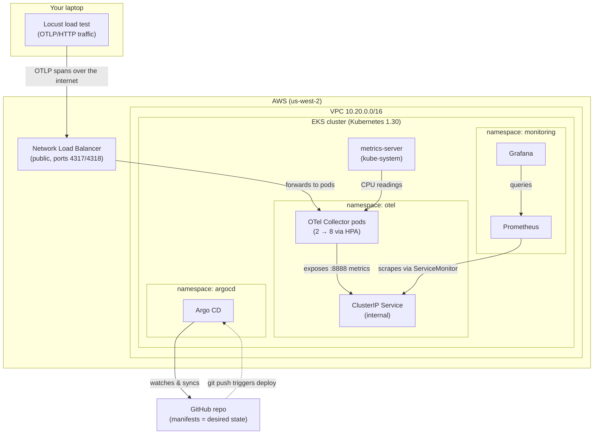
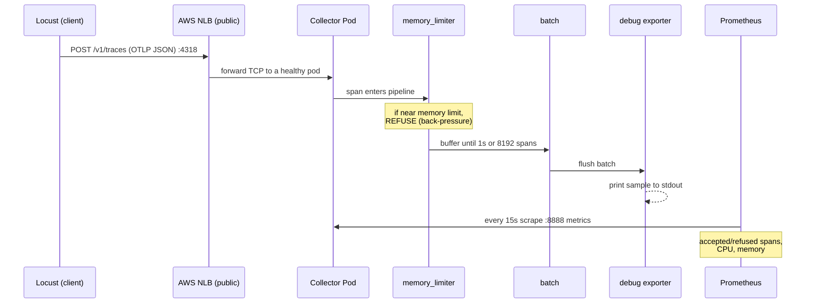
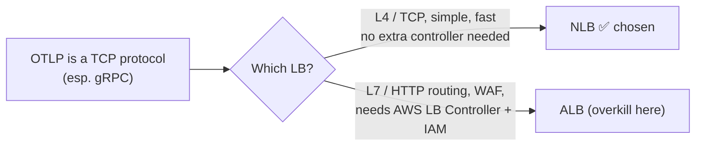
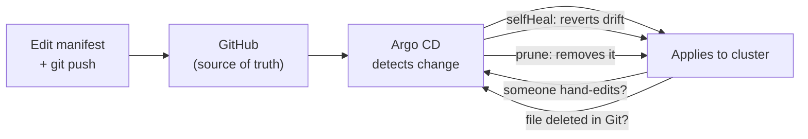

# OTel Collector on EKS — Presentation Walkthrough

A plain-English guide to what we built, why, and how it satisfies the exercise.
Read top to bottom; each section is something you can say out loud.

---

## 1. The one-sentence summary

> We used Terraform to stand up a private AWS network and a managed Kubernetes
> cluster, used Argo CD (GitOps) to deploy an OpenTelemetry Collector plus a
> Prometheus/Grafana monitoring stack, exposed the collector to the internet
> through an AWS Network Load Balancer, and load-tested it with Locust to find
> where it breaks first.

---

## 2. Big-picture architecture



**How to narrate it:** Traffic comes in from the left (Locust), hits the public
load balancer, lands on the collector pods. Everything inside the cluster is
deployed and kept in sync by Argo CD from GitHub. Prometheus watches the
collector and Grafana visualizes it.

---

## 3. What each part does (and which file owns it)

| Layer | What it is | Files |
|---|---|---|
| **Network** | Private VPC across 2 AZs; public subnets for the LB, private subnets for nodes; one NAT gateway for egress | `infra/main.tf` (vpc module) |
| **Cluster** | Managed EKS control plane + a 2-node worker group + core add-ons (CoreDNS, kube-proxy, VPC CNI, pod-identity) | `infra/main.tf` (eks module) |
| **The app** | The OTel Collector: receives OTLP, protects memory, batches, prints (debug) | `k8s/otel-collector/configmap.yaml` + `deployment.yaml` |
| **Internal access** | Stable in-cluster address for the collector (used by Prometheus) | `k8s/otel-collector/service.yaml` |
| **Public access** | The AWS NLB that lets the outside world send telemetry in | `k8s/otel-collector/service-nlb.yaml` |
| **Autoscaling** | Adds/removes collector pods based on CPU (2→8) | `k8s/otel-collector/hpa.yaml` + `metrics-server` |
| **Scrape config** | Tells Prometheus to collect the collector's own metrics | `k8s/otel-collector/servicemonitor.yaml` |
| **Observability** | Prometheus + Grafana + node/cluster metrics | `argocd/monitoring-application.yaml` |
| **GitOps** | Argo CD apps that deploy all of the above from Git | `argocd/*.yaml` |
| **Load test** | Locust generating mixed-shape OTLP traffic | `loadtest/locustfile.py` |

---

## 4. The data path (what happens to a single trace)



**Key teaching point:** the pipeline is always **receivers → processors →
exporters**, and `memory_limiter` comes **before** `batch` on purpose — you want
to reject data *before* it piles up in the batch buffer, not after.

---

## 5. What is the load balancer doing, and why? (expect to be asked)

**What it is:** `service-nlb.yaml` is a Kubernetes `Service` of `type:
LoadBalancer`. When Kubernetes sees that, the EKS cloud integration automatically
provisions a real **AWS Network Load Balancer** and gives it a public DNS name
(ours: `a1fed309...elb.us-west-2.amazonaws.com`).

**What it does for us:**
1. **Public entry point.** The collector pods live in *private* subnets with no
   public IPs. The NLB is the only thing reachable from the internet, so it's how
   Locust (running on your laptop) can send OTLP traffic into the cluster at all.
2. **Spreads load + handles pod churn.** It forwards incoming connections across
   whatever collector pods are currently healthy. As the HPA scales pods 2→8, the
   set of targets changes underneath — the public DNS name stays the same.
3. **Exposes only what's needed.** We publish only the two ingestion ports (4317
   gRPC, 4318 HTTP). The metrics (8888) and health (13133) ports stay internal.

**Why an NLB and not an ALB?**



- OTLP maps cleanly to **TCP-style (Layer 4)** load balancing → NLB is the natural fit.
- An **ALB (Layer 7)** adds host/path routing, WAF, etc. — useful for a real public
  HTTP API, but it requires installing the AWS Load Balancer Controller and IAM
  wiring. For a time-boxed ingestion endpoint that's unnecessary complexity.
- **Honest trade-off to mention:** if this were a production HTTP API needing
  path routing, TLS termination at L7, or a WAF, you'd reconsider and use an ALB.

---

## 6. Why GitOps / Argo CD (instead of `kubectl apply`)?



Git becomes the single source of truth: the cluster always matches what's in the
repo. `prune` deletes things you removed from Git; `selfHeal` undoes manual drift.
It's reproducible and auditable — you can rebuild the whole platform from the repo.

---

## 7. The load test design (why it's not "dummy traffic")

The brief explicitly asked **not** to send constant/identical traffic. So the test
mixes four request *shapes*, each probing a different potential bottleneck:

| Profile | Weight | Shape | Stresses |
|---|---|---|---|
| `small_trace` | 6 | 4 spans, 4 attrs | raw request throughput |
| `large_trace` | 2 | 200 spans + padding | serialization / payload size |
| `complex_trace` | 1 | 40 spans, 30 attrs | attribute parsing cost |
| `bursty_trace` | 1 | 10 requests per cycle | spiky load / queueing |

Every knob (span count, attr count, padding, burst size) is an env var, so the
same file drives all the profiles documented in `loadtest/README.md`.

---

## 8. How this maps to the requirements

| Requirement | How we met it |
|---|---|
| Provision infrastructure (IaC) | Terraform: VPC + EKS + node group + add-ons (`infra/`) |
| Deploy the OTel Collector | Kustomize manifests deployed by Argo CD (`k8s/otel-collector/`) |
| Expose it publicly | AWS NLB via `service-nlb.yaml` (OTLP 4317/4318) |
| Make it observable | Prometheus scrapes collector + nodes; Grafana dashboard (`dashboards/`) |
| Make it scale | HPA 2→8 on CPU, backed by metrics-server |
| Load test (varied, not constant) | Locust with 4 weighted, env-tunable profiles |
| Identify the first bottleneck | Run heavier profiles, watch Grafana, record in `notes.md` *(in progress)* |
| Repeatable / production-like | GitOps via Argo CD; `terraform destroy` tears it all down |

---

## 9. Current state (live)

- ✅ Cluster `otel-fde-onsite` ACTIVE, 2 nodes Ready (EKS 1.30)
- ✅ Argo CD synced: `otel`, `monitoring`, `metrics-server` all running
- ✅ NLB live with a public hostname; HPA at 2/8, CPU ~12%
- ✅ First load test (`small-baseline`) done — see below
- ⏳ **Left to do:** run the heavier profiles, capture the first bottleneck, fill in `notes.md`

### Small baseline result (25 users, 5 min)

| Metric | Value |
|---|---|
| Total requests | 7,115 |
| Failures | **0** |
| Throughput | ~60 req/s |
| p95 latency | 61 ms |
| p99 latency | 270 ms |
| Collector CPU | ~12% of limit |

**Reading:** the pipeline works end-to-end and the small profile barely loads the
collector — no scaling, no errors. That's the *baseline*; the real finding comes
from pushing the sustained / large-payload / bursty profiles until something gives.

### Expected first bottleneck (hypothesis to validate)

With 2× `t3.large` nodes (2 vCPU each) and a 1-CPU-per-pod limit starting at 2
replicas, the likely first failure is **collector CPU saturation** → HPA scales
2→8 → eventually **node CPU saturation**. Watch for `otelcol_receiver_refused_spans`
going nonzero and CPU throttling rising.

---

## 10. Likely questions & crisp answers

- **What does the batch processor do?** Buffers spans and flushes on a timer or
  size threshold, so we make fewer, larger export calls instead of one per span.
- **Why memory_limiter before batch?** The limiter must gate data *before* it
  enters the buffer; otherwise the buffer is what blows the memory budget.
- **Why NLB over ALB?** OTLP is TCP; NLB is the simpler L4 fit and skips the AWS
  LB Controller + IAM setup. ALB would be for L7 HTTP routing/WAF.
- **How would you scale further?** Bigger nodes, or HPA on a better signal than CPU
  (refused spans / queue depth / p95), and a real downstream exporter to test backpressure.
- **How is this reproducible?** Terraform for infra, GitOps for workloads; the repo
  fully describes the system and `terraform destroy` cleans it up.
```
